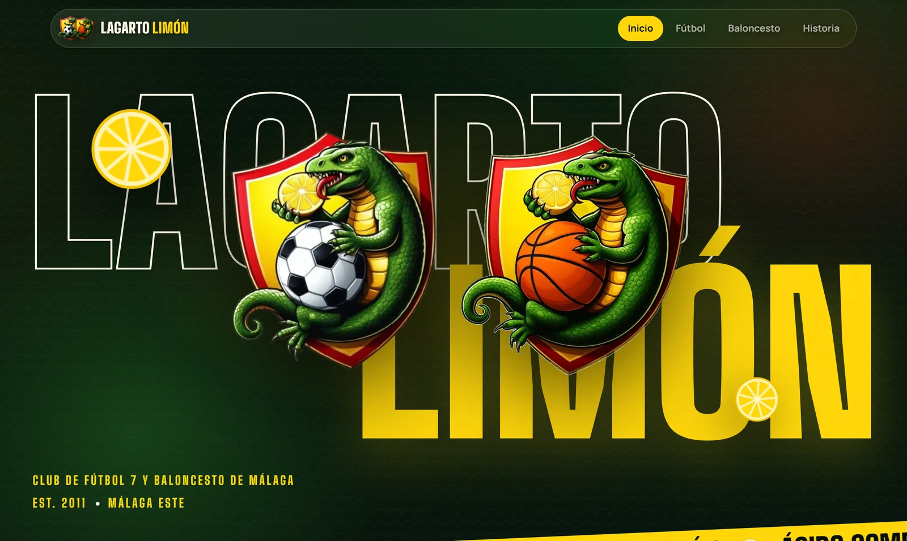
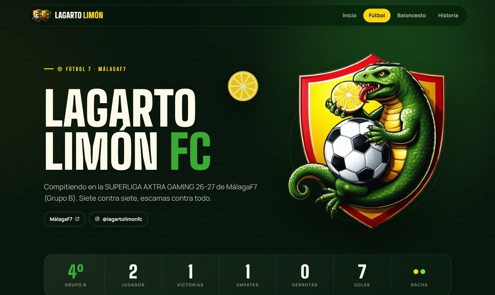
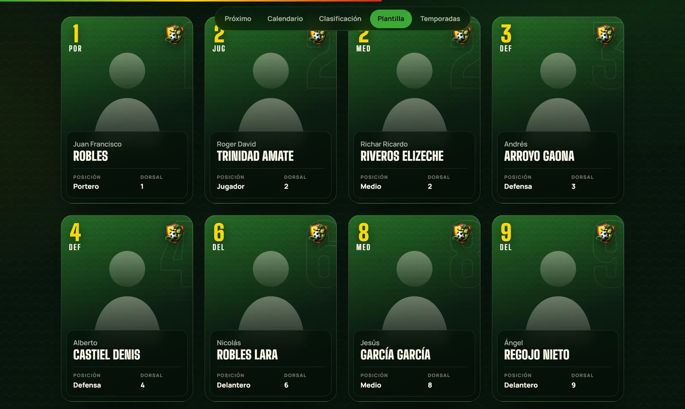
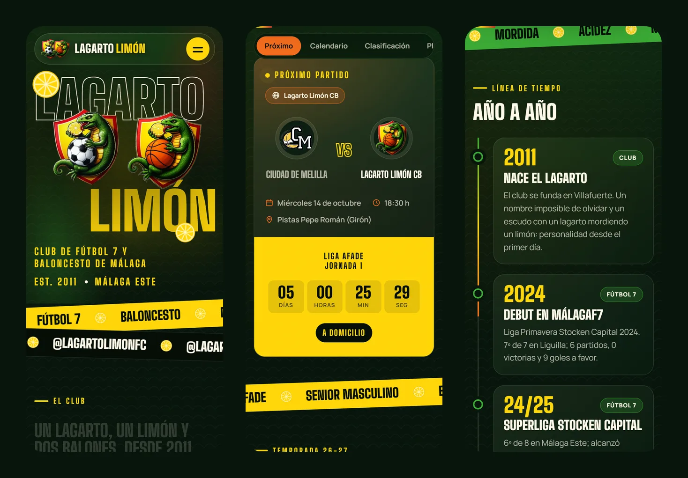
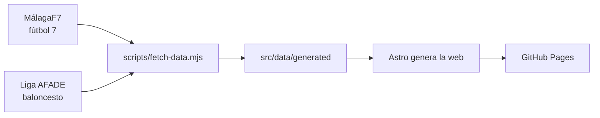

<div align="center">


&nbsp;&nbsp;&nbsp;


# Lagarto Limón

**Web del club de fútbol 7 y baloncesto de Málaga · desde 2011**

[](https://github.com/ivangarmar22/LagartoLimon/actions/workflows/deploy.yml)
[](https://astro.build)
[](https://gsap.com)
[](https://ivangarmar22.github.io/LagartoLimon/)

### [Ver la web →](https://ivangarmar22.github.io/LagartoLimon/)

</div>

<br />



## El proyecto

Web del **Lagarto Limón**, un club amateur malagueño con dos secciones:

|                                                     | Equipo                            | Competición                                             |
| :-------------------------------------------------: | --------------------------------- | ------------------------------------------------------- |
|  | **Lagarto Limón FC** · fútbol 7   | [MálagaF7](https://www.malagaf7.com)                    |
|  | **Lagarto Limón CB** · baloncesto | [Liga AFADE](https://ligaafade.es/resultados?deporte=6) |

Calendarios, resultados, clasificaciones y temporadas **se actualizan solos** a partir de las webs de las ligas: no hace falta tocar el código para que la web esté al día.

## Qué incluye

- **Portada** con las letras del club, los dos escudos animados al hacer scroll, cifras del club, próximos partidos con cuenta atrás, últimos resultados e historia en scroll horizontal.
- **Página de cada equipo** con próximo partido, calendario filtrable, clasificación, plantilla en fichas con efecto 3D y el historial de temporadas.
- **Historia** del club con una línea de tiempo que se dibuja al bajar, escudos y colores, valores y los campos donde juega.
- **Diseño adaptado** a móvil, tablet y escritorio, con efectos de cristal, parallax y animaciones que respetan la opción de reducir movimiento del sistema.

<table>
  <tr>
    <td width="50%"></td>
    <td width="50%"></td>
  </tr>
  <tr>
    <td align="center"><sub>Página del equipo</sub></td>
    <td align="center"><sub>Plantilla</sub></td>
  </tr>
</table>



## Cómo se actualizan los datos



La acción [`Publicar web`](.github/workflows/deploy.yml) se ejecuta con cada cambio en `main` y además **dos veces al día** (07:00 y 22:30 UTC). Si una liga no responde, se mantienen los últimos datos descargados y la web se publica igualmente.

Para actualizar al momento: **Actions → Publicar web → Run workflow**.

## Tecnologías

|                                             | Uso                                                           |
| ------------------------------------------- | ------------------------------------------------------------- |
| [Astro](https://astro.build)                | Genera la web estática                                        |
| [GSAP](https://gsap.com) + ScrollTrigger    | Animaciones ligadas al scroll                                 |
| [Lenis](https://lenis.darkroom.engineering) | Scroll suave                                                  |
| [Fontsource](https://fontsource.org)        | Big Shoulders Display y Manrope, servidas desde la propia web |
| GitHub Actions + Pages                      | Descarga de datos y publicación                               |

## Estructura

```text
├── .github/workflows/deploy.yml   Publicación automática
├── docs/                          Capturas de este README
├── public/img/                    Escudos (WebP para la web, PNG para iconos)
├── public/jugadores/              Fotos de los jugadores
├── scripts/fetch-data.mjs         Descarga los datos de las ligas
└── src/
    ├── components/                Piezas de la interfaz (fichas, partidos, tablas…)
    ├── data/club.ts               Datos que se editan a mano
    ├── data/generated/            Datos descargados de las ligas
    ├── lib/                       Lógica de datos, fechas e historia
    ├── pages/                     Portada, fútbol, baloncesto, historia y 404
    ├── scripts/main.ts            Animaciones e interacción
    └── styles/global.css          Colores, tipografía y estilos comunes
```

## Trabajar en local

Requiere **Node 22.12** o superior.

```bash
npm install
npm run fetch-data   # descarga los datos actuales de las ligas
npm run dev          # http://localhost:4321
```

| Comando              | Qué hace                         |
| -------------------- | -------------------------------- |
| `npm run dev`        | Servidor de desarrollo           |
| `npm run build`      | Genera la web en `dist/`         |
| `npm run preview`    | Sirve la versión generada        |
| `npm run fetch-data` | Actualiza los datos de las ligas |
| `npm run format`     | Formatea el código con Prettier  |

## Editar el contenido

Todo lo que no publican las ligas está en [`src/data/club.ts`](src/data/club.ts):

- **Datos del club:** fundación, lema y redes sociales.
- **Plantilla de baloncesto:** nombre, dorsal, posición y altura de cada jugador.
- **Extras del fútbol:** foto o apodo de cada jugador, usando su id de MálagaF7.
- **Cuerpo técnico e hitos** de la historia.

```ts
{ nombre: 'Iván', apellidos: 'García', dorsal: 22, posicion: 'Escolta', altura: 1.87 },
```

Las fotos van en `public/jugadores/`, en vertical (3:4), y se indican con `foto: 'jugadores/nombre.jpg'`.

## Publicación

La web se publica en **GitHub Pages** desde GitHub Actions (**Settings → Pages → Source: GitHub Actions**). La ruta base `/LagartoLimon/` se calcula sola a partir del nombre del repositorio.

<br />

<div align="center">
<sub>Los calendarios, resultados y clasificaciones proceden de <a href="https://www.malagaf7.com">MálagaF7</a> y la <a href="https://ligaafade.es">Liga AFADE</a>.</sub>
</div>
